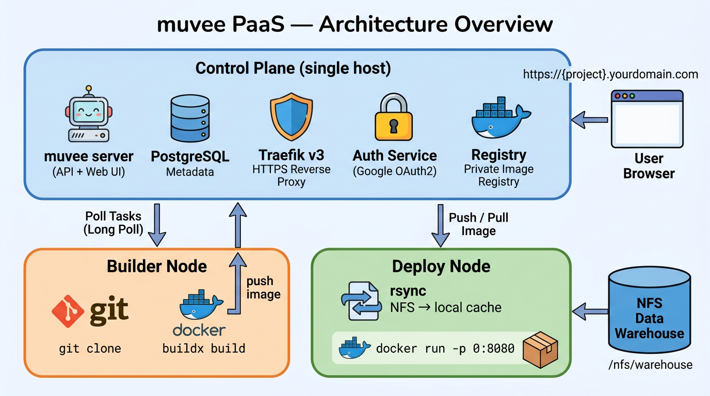

<div align="center">

<h1>muvee</h1>


<p>
  <a href="https://github.com/hoveychen/muvee/actions/workflows/ci.yml">
    
  </a>
  <a href="https://github.com/hoveychen/muvee/releases/latest">
    
  </a>
  <a href="https://github.com/hoveychen/muvee/blob/main/LICENSE">
    
  </a>
  <a href="https://goreportcard.com/report/github.com/hoveychen/muvee">
    
  </a>
  
  
</p>

<p><strong>Lightweight self-hosted PaaS for private clouds — Git → Docker → Deploy, with smart data warehouse integration.</strong></p>

<p>
  <strong>English</strong> · <a href="README.zh.md">中文</a> ·
  <a href="https://hoveychen.github.io/muvee">Docs</a> ·
  <a href="https://github.com/hoveychen/muvee/releases">Releases</a>
</p>

</div>

---

<div align="center">

</div>

---

## 🤖 Deploy with AI — One-Click via Agent Skill

muvee ships a built-in **Agent Skill** (`SKILL.md`) that teaches Cursor, Claude Code, Copilot, and other AI coding assistants how to use `muveectl`. Once the AI reads the skill, it can create projects, trigger deployments, and manage your cloud — all from a single instruction.

**Load the skill into your AI assistant:**

```
https://YOUR_MUVEE_SERVER/api/skill
```

> Replace `YOUR_MUVEE_SERVER` with the domain of your muvee instance (e.g. `https://example.com`).  
> You can also find the live URL on the Community page of your muvee deployment.

---

## What is muvee?

**muvee** stands for **M**icroservices **U**nified **V**irtualized **E**xecution **E**ngine.

muvee is a **self-hosted PaaS** designed for private clouds with many lightweight applications. No Kubernetes, no YAML sprawl. Push a tag → binary is released. Connect a Git repo → container is deployed.

Key features:

- **Git → Docker → Deploy** — point at a repo with a `Dockerfile`, click Deploy. muvee builds the image on a builder node, pushes to its internal registry, and runs the container on a deploy node, wired to `{project}.yourdomain.com` automatically via Traefik.
- **Data Warehouse Integration** — declare NFS-backed datasets as dependencies. muvee rsyncs them to the deploy node (LRU-cached, versioned) and mounts them into the container at `/data/{name}`. Or declare a dataset as `readwrite` for a direct NFS bind-mount.
- **Smart Affinity Scheduling** — deploy nodes are scored by how many required datasets they already have cached, minimizing rsync time.
- **File-level Dataset Tracking** — a background monitor scans NFS paths, diffs file trees, and records a `git log`–style history of every file change (added / modified / deleted), with per-file timelines in the UI.
- **Flexible Identity Providers** — sign in via Google, Feishu/Lark, WeCom (企业微信), or DingTalk (钉钉). Multiple providers can be enabled simultaneously. Per-project ForwardAuth supports Google for protecting deployed apps.
- **Single binary** — one `muvee` binary runs as `muvee server`, `muvee agent`, or `muvee authservice`. The server subcommand embeds the React web UI — no separate web server needed.

## Quick Start

**Prerequisites — DNS**

Point a wildcard A record at your VPS IP before starting:

```
Type  Name               Value
A     example.com        <your-vps-ip>   (control panel)
A     *.example.com      <your-vps-ip>   (covers all project subdomains, including www)
```

Make sure ports **80** and **443** are open on the VPS firewall. Traefik will obtain a Let's Encrypt certificate automatically.

**1 — Configure an identity provider**

muvee requires at least one identity provider. You can enable multiple simultaneously — the login page shows a button for each. Supported providers:

| Provider | Env vars to set |
|---|---|
| [Google](https://hoveychen.github.io/muvee/docs/auth/google) | `GOOGLE_CLIENT_ID`, `GOOGLE_CLIENT_SECRET` |
| [Feishu / Lark](https://hoveychen.github.io/muvee/docs/auth/feishu) | `FEISHU_APP_ID`, `FEISHU_APP_SECRET` |
| [WeCom 企业微信](https://hoveychen.github.io/muvee/docs/auth/wecom) | `WECOM_CORP_ID`, `WECOM_CORP_SECRET`, `WECOM_AGENT_ID` |
| [DingTalk 钉钉](https://hoveychen.github.io/muvee/docs/auth/dingtalk) | `DINGTALK_CLIENT_ID`, `DINGTALK_CLIENT_SECRET` |

**2 — Configure**

```bash
git clone https://github.com/hoveychen/muvee.git && cd muvee
cp .env.example .env
# Edit .env — fill in BASE_DOMAIN, at least one identity provider,
#             JWT_SECRET, ACME_EMAIL, ADMIN_EMAILS,
#             REGISTRY_USER, REGISTRY_PASSWORD,
#             AGENT_SECRET (shared secret for agent authentication)
```

**3 — Generate registry credentials**

The private registry requires a htpasswd file. Run once on the control plane host:

```bash
docker run --entrypoint htpasswd httpd:2 -Bbn <REGISTRY_USER> <REGISTRY_PASSWORD> > registry/htpasswd
```

Use the same `REGISTRY_USER` / `REGISTRY_PASSWORD` values you set in `.env`.

**4 — Start the control plane**

```bash
docker network create muvee-net
docker compose up -d
```

Traefik is now listening on 443. Open `https://BASE_DOMAIN` and sign in with your configured identity provider. Admin accounts listed in `ADMIN_EMAILS` also gain access to `https://traefik.BASE_DOMAIN`.

**5 — Register worker nodes**

Run the following on each worker machine. Registry credentials and `BASE_DOMAIN` are **automatically distributed** from the control plane — agents fetch them via `/api/agent/config` on startup, so you don't need to configure them per node.

> `CONTROL_PLANE_URL` must be the **internal network address** of the control plane (e.g. `http://10.0.0.1:8080`), not the public domain. The agent uses this to detect the correct network interface for Traefik routing.

> **Using an AI assistant?** Load the install-agent skill and let your AI walk you through the setup:
> ```
> https://raw.githubusercontent.com/hoveychen/muvee/main/.cursor/skills/install-agent/SKILL.md
> ```

**Linux (Docker)**

```bash
# Builder node
docker run -d --name muvee-agent --restart unless-stopped \
  -e NODE_ROLE=builder \
  -e CONTROL_PLANE_URL=http://10.0.0.1:8080 \
  -e AGENT_SECRET=<your-agent-secret> \
  -v /var/run/docker.sock:/var/run/docker.sock \
  ghcr.io/hoveychen/muvee:latest agent

# Deploy node
docker run -d --name muvee-agent --restart unless-stopped \
  -e NODE_ROLE=deploy \
  -e CONTROL_PLANE_URL=http://10.0.0.1:8080 \
  -e AGENT_SECRET=<your-agent-secret> \
  -v /var/run/docker.sock:/var/run/docker.sock \
  -v /muvee/data:/muvee/data \
  -v /nfs/warehouse:/nfs/warehouse \
  ghcr.io/hoveychen/muvee:latest agent
```

**macOS (binary — recommended)**

Docker Desktop on macOS runs containers inside a Linux VM, so `docker.sock` inside a container points to the VM rather than your Mac. Use the native binary instead:

```bash
# Download (Apple Silicon)
curl -Lo muvee https://github.com/hoveychen/muvee/releases/latest/download/muvee_darwin_arm64
chmod +x muvee && sudo mv muvee /usr/local/bin/

# Builder node
NODE_ROLE=builder CONTROL_PLANE_URL=http://10.0.0.1:8080 AGENT_SECRET=<secret> \
  muvee agent

# Deploy node
NODE_ROLE=deploy CONTROL_PLANE_URL=http://10.0.0.1:8080 AGENT_SECRET=<secret> \
  DATA_DIR=/Users/Shared/muvee/data muvee agent
```

**Windows (binary via WSL2 — recommended)**

Run the agent inside WSL2 so it has access to `docker.sock`, `rsync`, and Linux paths:

```bash
# Inside WSL2 shell
curl -Lo muvee https://github.com/hoveychen/muvee/releases/latest/download/muvee_linux_amd64
chmod +x muvee

NODE_ROLE=deploy CONTROL_PLANE_URL=http://10.0.0.1:8080 AGENT_SECRET=<secret> \
  DATA_DIR=/mnt/c/muvee/data ./muvee agent
```

> Ensure Docker Desktop → Settings → **Use the WSL 2 based engine** is enabled, and the WSL2 distro is allowed under **Resources → WSL Integration**.

See the **[Agent Installation Guide →](https://hoveychen.github.io/muvee/docs/install-agent)** for full step-by-step instructions including dependency setup.

See the **[full documentation →](https://hoveychen.github.io/muvee)**

## Architecture at a Glance



```
Control Plane (single host)
  muvee-server    — API + Web UI (Go, embeds React)
  muvee-authsvc   — Traefik ForwardAuth sidecar
  PostgreSQL      — metadata
  Traefik v3      — HTTPS reverse proxy, auto-routing
  Distribution    — private Docker registry

Worker Nodes (any number, any mix)
  muvee-agent     — builder or deploy role, polls control plane
```

## Release Binaries

**Server / Agent** — pre-built for Linux and macOS (amd64 + arm64):

```bash
curl -L https://github.com/hoveychen/muvee/releases/latest/download/muvee_linux_amd64.tar.gz | tar xz
./muvee_linux_amd64 server      # starts API + web UI on :8080, auto-migrates DB
./muvee_linux_amd64 agent       # worker node (set NODE_ROLE=builder or deploy)
./muvee_linux_amd64 authservice # Traefik ForwardAuth sidecar
```

**muveectl** — CLI client for Linux, macOS, and Windows:

```bash
# macOS (Apple Silicon)
curl -Lo muveectl https://github.com/hoveychen/muvee/releases/latest/download/muveectl_darwin_arm64
chmod +x muveectl && sudo mv muveectl /usr/local/bin/

# Linux (amd64)
curl -Lo muveectl https://github.com/hoveychen/muvee/releases/latest/download/muveectl_linux_amd64
chmod +x muveectl && sudo mv muveectl /usr/local/bin/
```

```bash
muveectl login --server https://example.com  # first-time setup
muveectl projects list
muveectl projects deploy PROJECT_ID
```

See the [muveectl CLI reference](https://hoveychen.github.io/muvee/docs/muveectl) for full command documentation.

## Prerequisites

| | |
|---|---|
| Control plane host | Linux, Docker |
| Worker nodes | Linux, Docker + Buildx, rsync, `git` |
| NFS share | Mounted at the same path on all deploy nodes |
| PostgreSQL 16+ | Can use the bundled Docker Compose service |
| Identity provider | At least one of: [Google](https://hoveychen.github.io/muvee/docs/auth/google), [Feishu/Lark](https://hoveychen.github.io/muvee/docs/auth/feishu), [WeCom](https://hoveychen.github.io/muvee/docs/auth/wecom), [DingTalk](https://hoveychen.github.io/muvee/docs/auth/dingtalk) |

## Documentation

- [Getting Started](https://hoveychen.github.io/muvee/docs/getting-started)
- [Installation](https://hoveychen.github.io/muvee/docs/installation)
- [Configuration Reference](https://hoveychen.github.io/muvee/docs/configuration)
- **Authentication** — [Google](https://hoveychen.github.io/muvee/docs/auth/google) · [Feishu/Lark](https://hoveychen.github.io/muvee/docs/auth/feishu) · [WeCom](https://hoveychen.github.io/muvee/docs/auth/wecom) · [DingTalk](https://hoveychen.github.io/muvee/docs/auth/dingtalk)
- [Architecture](https://hoveychen.github.io/muvee/docs/architecture)
- [Scheduler & Affinity](https://hoveychen.github.io/muvee/docs/scheduler)
- [Dataset Monitor](https://hoveychen.github.io/muvee/docs/dataset-monitor)
- [ForwardAuth & Access Control](https://hoveychen.github.io/muvee/docs/forward-auth)
- [muveectl CLI](https://hoveychen.github.io/muvee/docs/muveectl)

---

## Contributing

Issues and pull requests are welcome. See [CONTRIBUTING.md](CONTRIBUTING.md) if you'd like to contribute.

## License

Apache 2.0 — see [LICENSE](LICENSE)
