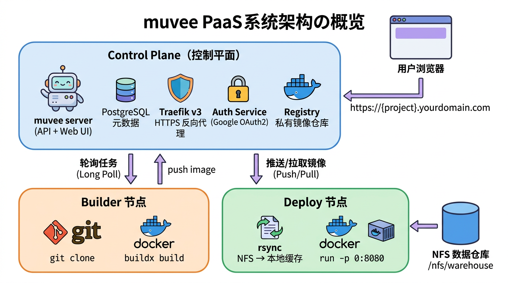

<div align="center">

<h1>muvee</h1>


<p>
  <a href="https://github.com/hoveychen/muvee/actions/workflows/ci.yml">
    
  </a>
  <a href="https://github.com/hoveychen/muvee/releases/latest">
    
  </a>
  <a href="https://github.com/hoveychen/muvee/blob/main/LICENSE">
    
  </a>
  <a href="https://goreportcard.com/report/github.com/hoveychen/muvee">
    
  </a>
  
  
</p>

<p><strong>面向私有云的轻量自托管 PaaS — Git → Docker → 一键部署，内置智能数据仓库集成。</strong></p>

<p>
  <a href="README.md">English</a> · <strong>中文</strong> ·
  <a href="https://hoveychen.github.io/muvee">文档</a> ·
  <a href="https://github.com/hoveychen/muvee/releases">下载</a>
</p>

</div>

---

<div align="center">

</div>

---

## 🤖 用 AI 一键部署 — Agent Skill

muvee 内置一份 **Agent Skill**（`SKILL.md`），让 Cursor、Claude Code、Copilot 等 AI 编程助手自动学会使用 `muveectl`。AI 读取 Skill 后，仅凭一句话即可创建项目、触发部署、管理整个私有云。

**将 Skill 地址添加到你的 AI 助手：**

```
https://YOUR_MUVEE_SERVER/api/skill
```

> 把 `YOUR_MUVEE_SERVER` 替换为你的 muvee 实例域名（如 `https://example.com`）。  
> 也可以在 muvee 部署的 Community 页面直接复制该地址。

---

## muvee 是什么？

**muvee** 是 **M**icroservices **U**nified **V**irtualized **E**xecution **E**ngine 的缩写（微服务统一虚拟化执行引擎）。

muvee 是一个面向私有云的**轻量自托管 PaaS**，专为大量小型应用的快速上线设计。不需要 Kubernetes，不需要复杂配置。绑定 Git 仓库，点击发布，应用即上线。

核心功能：

- **Git → Docker → 部署** — 指向一个含 `Dockerfile` 的仓库，点击"发布"。muvee 在 Builder 节点构建镜像，推送到内部 Registry，在 Deploy 节点启动容器，并通过 Traefik 自动路由到 `{project}.example.com`。
- **数据仓库集成** — 在 Project 中声明 NFS 上的数据集作为依赖。muvee 将数据 rsync 到部署节点（LRU 缓存、版本管理），并以 `/data/{name}` 挂载进容器。也支持 `readwrite` 模式，直接 NFS bind-mount，不拷贝。
- **亲和性调度** — 部署节点根据已缓存的数据集数量打分，优先选择无需大量 rsync 的节点，最小化数据同步开销。
- **文件级数据追踪** — 后台 Monitor 定时扫描 NFS 路径，对比文件树，记录每个文件的 added / modified / deleted 历史，UI 提供类似 `git log --follow` 的单文件时间轴视图。
- **灵活身份认证** — 支持 Google、飞书/Lark、企业微信、钉钉登录，多个 Provider 可同时启用，登录页自动展示对应按钮。per-project ForwardAuth 支持通过 Google 保护已部署的应用。
- **单一二进制** — 一个 `muvee` 二进制，通过子命令区分角色：`muvee server` / `muvee agent` / `muvee authservice`。`server` 子命令内嵌 React 前端，无需额外 Web 服务器。

## 5 分钟快速部署

**前置条件 — DNS 配置**

在启动之前，先将以下 DNS 记录指向你的 VPS 公网 IP：

```
类型  主机名                值
A     example.com          <你的 VPS IP>   （控制面板）
A     *.example.com        <你的 VPS IP>   （覆盖所有 project 子域名，含 www）
```

确保 VPS 防火墙放行 **80** 和 **443** 端口。Traefik 会自动向 Let's Encrypt 申请 HTTPS 证书。

**第 1 步 — 配置身份认证 Provider**

muvee 至少需要一个身份认证 Provider，多个可同时启用。支持的 Provider：

| Provider | 需配置的环境变量 |
|---|---|
| [Google](https://hoveychen.github.io/muvee/zh/docs/auth/auth-google) | `GOOGLE_CLIENT_ID`、`GOOGLE_CLIENT_SECRET` |
| [飞书 / Lark](https://hoveychen.github.io/muvee/zh/docs/auth/auth-feishu) | `FEISHU_APP_ID`、`FEISHU_APP_SECRET` |
| [企业微信](https://hoveychen.github.io/muvee/zh/docs/auth/auth-wecom) | `WECOM_CORP_ID`、`WECOM_CORP_SECRET`、`WECOM_AGENT_ID` |
| [钉钉](https://hoveychen.github.io/muvee/zh/docs/auth/auth-dingtalk) | `DINGTALK_CLIENT_ID`、`DINGTALK_CLIENT_SECRET` |

各 Provider 的详细配置步骤见上方链接。

**第 2 步 — 配置**

```bash
git clone https://github.com/hoveychen/muvee.git && cd muvee
cp .env.zh.example .env
# 编辑 .env，填写 BASE_DOMAIN、至少一个 Provider 的配置、JWT_SECRET、ACME_EMAIL
#             ADMIN_EMAILS（管理员邮箱）、REGISTRY_USER、REGISTRY_PASSWORD
#             AGENT_SECRET（agent 认证共享密钥，所有 agent 节点需相同）
```

**第 3 步 — 生成 Registry 凭证**

私有镜像仓库需要 htpasswd 文件做基础认证，在控制平面主机上执行一次：

```bash
docker run --entrypoint htpasswd httpd:2 -Bbn <REGISTRY_USER> <REGISTRY_PASSWORD> > registry/htpasswd
```

`REGISTRY_USER` / `REGISTRY_PASSWORD` 与 `.env` 中的配置保持一致。

**第 4 步 — 启动**

**单机 Standalone**（所有组件在一台机器上，推荐新用户使用）：

```bash
docker compose up -d
```

此命令在同一台机器上启动所有组件：控制面板、Agent（builder + deploy）、Traefik、PostgreSQL 和私有镜像仓库。

**多节点**（Agent 运行在独立的工作机器上）：

```bash
# 在控制平面主机上执行 — 仅启动控制面板
docker compose -f docker-compose.server.yml up -d
```

然后分别在每台工作节点上注册 Agent（见第 5 步）。

Traefik 开始监听 443 端口。在浏览器中打开 `https://BASE_DOMAIN`，使用已配置的身份认证 Provider 登录。`ADMIN_EMAILS` 中配置的管理员账号还可访问 `https://traefik.BASE_DOMAIN` Traefik 控制面板。

**第 5 步 — 注册工作节点** *（仅多节点部署需要，Standalone 可跳过此步）*

在每台工作机器上执行。Registry 凭证和 `BASE_DOMAIN` 由控制平面**自动下发** —— Agent 启动后会通过 `/api/agent/config` 接口拉取，无需在每个节点手动配置。

> `CONTROL_PLANE_URL` 必须填写控制平面的**内网地址**（如 `http://10.0.0.1:8080`），不要使用公网域名。Agent 通过该地址自动探测正确的出网接口，确保 Traefik 能路由到已部署的容器。

> **用 AI 助手来操作？** 加载 install-agent skill，让 AI 帮你完成全套安装：
> ```
> https://raw.githubusercontent.com/hoveychen/muvee/main/.cursor/skills/install-agent/SKILL.md
> ```

**Linux（Docker）**

```bash
# Builder 节点
docker run -d --name muvee-agent --restart unless-stopped \
  -e NODE_ROLE=builder \
  -e CONTROL_PLANE_URL=http://10.0.0.1:8080 \
  -e AGENT_SECRET=<your-agent-secret> \
  -v /var/run/docker.sock:/var/run/docker.sock \
  ghcr.io/hoveychen/muvee:latest agent

# Deploy 节点
docker run -d --name muvee-agent --restart unless-stopped \
  -e NODE_ROLE=deploy \
  -e CONTROL_PLANE_URL=http://10.0.0.1:8080 \
  -e AGENT_SECRET=<your-agent-secret> \
  -v /var/run/docker.sock:/var/run/docker.sock \
  -v /muvee/data:/muvee/data \
  -v /nfs/warehouse:/nfs/warehouse \
  ghcr.io/hoveychen/muvee:latest agent
```

**macOS（二进制，推荐）**

Docker Desktop 在 macOS 上将容器跑在 Linux 虚拟机内，容器里的 `docker.sock` 指向虚拟机，无法正确控制宿主机。建议使用原生二进制：

```bash
# 下载（Apple Silicon）
curl -Lo muvee https://github.com/hoveychen/muvee/releases/latest/download/muvee_darwin_arm64
chmod +x muvee && sudo mv muvee /usr/local/bin/

# Builder 节点
NODE_ROLE=builder CONTROL_PLANE_URL=http://10.0.0.1:8080 AGENT_SECRET=<密钥> \
  muvee agent

# Deploy 节点
NODE_ROLE=deploy CONTROL_PLANE_URL=http://10.0.0.1:8080 AGENT_SECRET=<密钥> \
  DATA_DIR=/Users/Shared/muvee/data muvee agent
```

**Windows（WSL2 内运行，推荐）**

在 WSL2 环境中运行 Linux 二进制，可以直接使用 `docker.sock`、`rsync` 和 Linux 路径：

```bash
# 在 WSL2 Shell 中执行
curl -Lo muvee https://github.com/hoveychen/muvee/releases/latest/download/muvee_linux_amd64
chmod +x muvee

NODE_ROLE=deploy CONTROL_PLANE_URL=http://10.0.0.1:8080 AGENT_SECRET=<密钥> \
  DATA_DIR=/mnt/c/muvee/data ./muvee agent
```

> 确保 Docker Desktop → 设置 → **使用 WSL 2 引擎**已开启，并在 **资源 → WSL 集成** 中允许当前 WSL2 发行版访问 Docker。

完整的分步安装指南（含依赖安装）见 **[Agent 安装指引 →](https://hoveychen.github.io/muvee/docs/install-agent)**。

## 整体架构



```
控制平面（单台主机）
  muvee-server    — API + Web UI（Go，内嵌 React）
  muvee-authsvc   — Traefik ForwardAuth 认证服务
  PostgreSQL      — 元数据存储
  Traefik v3      — HTTPS 反向代理，自动路由
  Distribution    — 私有 Docker 镜像仓库

工作节点（任意数量，混合角色）
  muvee-agent     — builder 或 deploy 角色，轮询控制平面获取任务
```

## 下载预编译二进制

**服务端 / Agent** — 支持 Linux / macOS（amd64 + arm64）：

```bash
curl -L https://github.com/hoveychen/muvee/releases/latest/download/muvee_linux_amd64.tar.gz | tar xz
./muvee_linux_amd64 server      # 启动 API + Web UI，监听 :8080，自动执行数据库迁移
./muvee_linux_amd64 agent       # 工作节点（设置 NODE_ROLE=builder 或 deploy）
./muvee_linux_amd64 authservice # Traefik ForwardAuth 认证服务
```

**muveectl** — 命令行客户端，支持 Linux / macOS / Windows：

```bash
# macOS (Apple Silicon)
curl -Lo muveectl https://github.com/hoveychen/muvee/releases/latest/download/muveectl_darwin_arm64
chmod +x muveectl && sudo mv muveectl /usr/local/bin/

# Linux (amd64)
curl -Lo muveectl https://github.com/hoveychen/muvee/releases/latest/download/muveectl_linux_amd64
chmod +x muveectl && sudo mv muveectl /usr/local/bin/
```

```bash
muveectl login --server https://example.com  # 首次配置
muveectl projects list
muveectl projects deploy PROJECT_ID
```

完整命令参考见 [muveectl CLI 文档](https://hoveychen.github.io/muvee/docs/muveectl)。

## 环境要求

| | |
|---|---|
| 控制平面主机 | Linux，Docker |
| 工作节点 | Linux，Docker + Buildx，rsync，`git` |
| NFS 共享 | 所有 Deploy 节点以相同路径挂载 |
| PostgreSQL 16+ | 可使用内置 Docker Compose 服务 |
| 身份认证 Provider | 至少一个：[Google](https://hoveychen.github.io/muvee/zh/docs/auth/auth-google)、[飞书/Lark](https://hoveychen.github.io/muvee/zh/docs/auth/auth-feishu)、[企业微信](https://hoveychen.github.io/muvee/zh/docs/auth/auth-wecom)、[钉钉](https://hoveychen.github.io/muvee/zh/docs/auth/auth-dingtalk) |

## 详细文档

- [快速开始](https://hoveychen.github.io/muvee/zh/docs/getting-started)
- [安装](https://hoveychen.github.io/muvee/zh/docs/installation)
- [配置参考](https://hoveychen.github.io/muvee/zh/docs/configuration)
- **身份认证** — [Google](https://hoveychen.github.io/muvee/zh/docs/auth/auth-google) · [飞书/Lark](https://hoveychen.github.io/muvee/zh/docs/auth/auth-feishu) · [企业微信](https://hoveychen.github.io/muvee/zh/docs/auth/auth-wecom) · [钉钉](https://hoveychen.github.io/muvee/zh/docs/auth/auth-dingtalk)
- [整体架构](https://hoveychen.github.io/muvee/zh/docs/architecture)
- [调度器与亲和性](https://hoveychen.github.io/muvee/zh/docs/scheduler)
- [数据集监控](https://hoveychen.github.io/muvee/zh/docs/dataset-monitor)
- [ForwardAuth 与访问控制](https://hoveychen.github.io/muvee/zh/docs/forward-auth)
- [muveectl CLI](https://hoveychen.github.io/muvee/zh/docs/muveectl)

---

## Contributing

欢迎提交 Issue 和 Pull Request。详见 [CONTRIBUTING.md](CONTRIBUTING.md)。

## License

Apache 2.0 — see [LICENSE](LICENSE)
